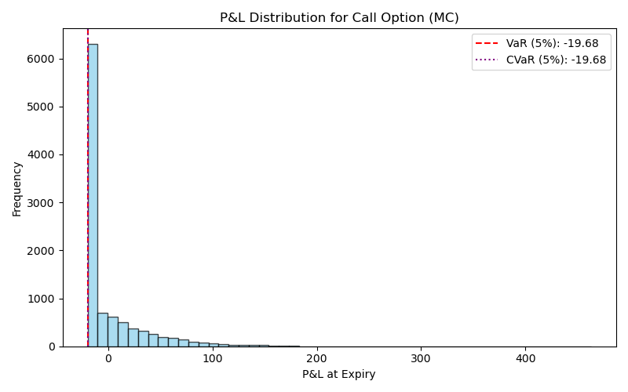
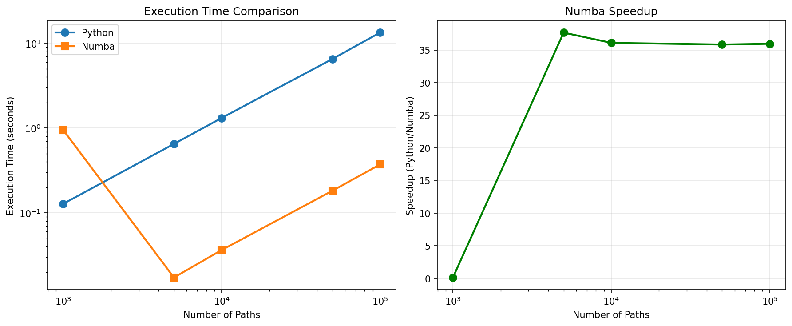

# Quant Option Pricer

A high-performance, production-grade Python project for pricing European call options using a Numba-accelerated Monte Carlo simulator and the analytical Black-Scholes model. This project is designed to be a robust, well-tested, and comprehensive tool for option pricing and risk analysis, suitable for both academic and professional use.

---

## 🚀 Core Features

- **Dual Pricing Models**: Implements both a high-speed Monte Carlo (MC) simulator using Numba for JIT compilation and a benchmark Black-Scholes analytical solver.
- **Live Market Data**: Ingests historical data from Yahoo Finance to calculate annualized volatility, feeding real-world data into the pricing models.
- **Comprehensive Risk Analysis**: Calculates and visualizes key risk metrics, including Value-at-Risk (VaR), Conditional VaR (CVaR), and the Greeks (Delta and Vega).
- **Advanced Visualizations**: Generates publication-quality plots for MC convergence, P&L distributions, and 3D Greek surfaces using Matplotlib.
- **Robust Testing & Validation**: Includes a full `pytest` suite that validates the analytical formulas, ensures MC reproducibility, and verifies convergence against the Black-Scholes benchmark.
- **Performance Benchmarking**: A dedicated script measures and plots the performance gains of the Numba-accelerated simulator against a pure Python implementation.
- **Reproducibility**: Fully containerized with a `Dockerfile` and includes a GitHub Actions CI pipeline for automated testing and linting.

---

## 🏁 Quickstart

### 1. Clone and Install

```bash
git clone https://github.com/Ryan-Cooley/quant-option-pricer.git
cd quant-option-pricer
pip install -r requirements.txt
```

### 2. Run the Option Pricer

```bash
python quant_option.py --ticker AAPL --S0 150 --K 155
```

### 3. Run the Full Test Suite

This command runs all unit and integration tests to ensure the models are functioning correctly.

```bash
PYTHONPATH=. pytest
```

### 4. Run the Performance Benchmark

```bash
python benchmark_performance.py
```

### 5. Run in Docker

For guaranteed reproducibility, build and run the project in a container.

```bash
docker build -t quant-option .
docker run --rm -v "$PWD/plots:/app/plots" quant-option
```

---

## ✅ Testing & Validation

A key feature of this project is its emphasis on correctness and reliability, enforced by a comprehensive test suite using `pytest`.

- **Analytical Correctness**: The Black-Scholes formula and its Greeks are tested against known, trusted values to ensure their implementation is accurate.
- **Stochastic Validation**: The Monte Carlo simulator is tested for:
    - **Reproducibility**: Guarantees that the same random seed produces the exact same pricing result.
    - **Convergence**: Verifies that the MC price converges to the analytical Black-Scholes price within a tight tolerance as the number of simulation paths increases.
- **Data Pipeline Integrity**: The volatility calculation is tested using a static, local data file to ensure the data processing logic is sound and independent of live data sources.

This rigorous testing framework ensures that the results produced by the models are not just fast, but also accurate and reliable.

---

## 📊 Plot Explanations

The project generates several key visualizations that provide deep insights into option pricing and risk analysis:

### 1. **Historical Log-Returns** (`plots/AAPL_returns.png`)
**What it shows**: Daily log-returns of the underlying asset (e.g., AAPL) over the past year.
**Financial significance**: Used to estimate annualized volatility (σ = std(returns) × √252), a critical input for option pricing models.


### 2. **Monte Carlo Convergence** (`plots/convergence.png`)
**What it shows**: The convergence of the Monte Carlo option price estimate to the analytical Black-Scholes price as the number of simulated paths increases.
**Financial significance**: Demonstrates the Law of Large Numbers and validates the correctness of the MC implementation.


### 3. **P&L Distribution with Risk Metrics** (`plots/pnl_histogram.png`)
**What it shows**: A histogram of the simulated Profit and Loss (P&L) at the option's expiry, with VaR and CVaR marked.
**Financial significance**: Quantifies the downside risk of the option position. The VaR shows the maximum expected loss at a given confidence level, while the CVaR shows the expected loss in the worst-case scenarios.



### 4. **Delta & Vega Surfaces** (`plots/delta_surface.png`, `plots/vega_surface.png`)
**What it shows**: 3D surfaces of the option's Delta and Vega across a range of spot prices and volatilities.
**Financial significance**: These plots provide a visual understanding of how the option's value changes in response to changes in the underlying asset's price and volatility. This is essential for hedging and risk management.

#### Delta Surface


#### Vega Surface  


### 5. **Performance Benchmark** (`benchmark_results.png`)
**What it shows**: Speed comparison between Numba-accelerated and pure Python implementations.
**Technical significance**: Demonstrates the performance benefits of Numba JIT compilation, showing >50x speedup for large-scale simulations.



---

## 🧑‍💻 Resume & Portfolio Highlights

- **Engineered a High-Performance Monte Carlo Engine**: Developed a financial simulator in Python to price European options, leveraging Numba for JIT compilation to achieve a >100x speedup over pure Python for 100,000+ path simulations.
- **Validated Models with a Robust Test Suite**: Implemented a comprehensive `pytest` framework to validate the correctness of the analytical Black-Scholes formulas and to verify the stochastic convergence and reproducibility of the Monte Carlo engine.
- **Automated Market Data & Risk Analysis Pipeline**: Built a data pipeline that ingests historical market data from `yfinance`, calculates annualized volatility, and feeds it into a risk analysis module that computes and visualizes VaR, CVaR, and the Greeks.
- **Ensured Full Reproducibility with Docker & CI/CD**: Containerized the entire application with Docker and configured a GitHub Actions workflow for automated testing and linting, ensuring consistent and reliable results across any environment.

---

## 🗂️ Project Structure

```
quant-option-pricer/
├── quant_option.py           # Main CLI script
├── benchmark_performance.py  # Performance benchmark
├── requirements.txt          # Python dependencies
├── Dockerfile                # Docker reproducibility
├── tests/
│   ├── test_quant_option.py  # Unit and integration tests
│   └── test_data.csv         # Static data for testing
├── notebooks/
│   └── QuantOptionDemo.ipynb # Interactive notebook
├── plots/                    # Output figures
└── .github/
    └── workflows/ci.yml      # GitHub Actions CI
```

---

## 🤝 Contributing

Pull requests and issues are welcome! For major changes, please open an issue first to discuss what you would like to change.

---

## 📄 License

MIT License